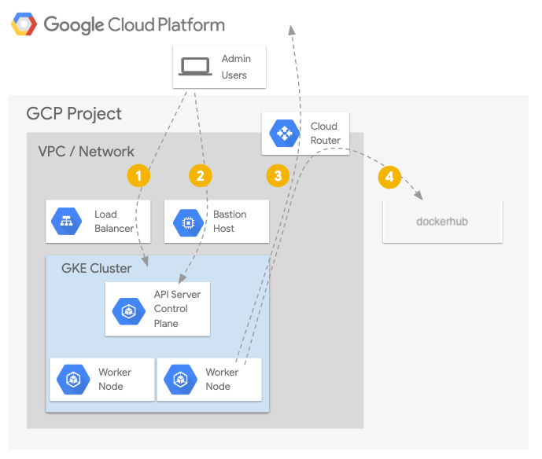
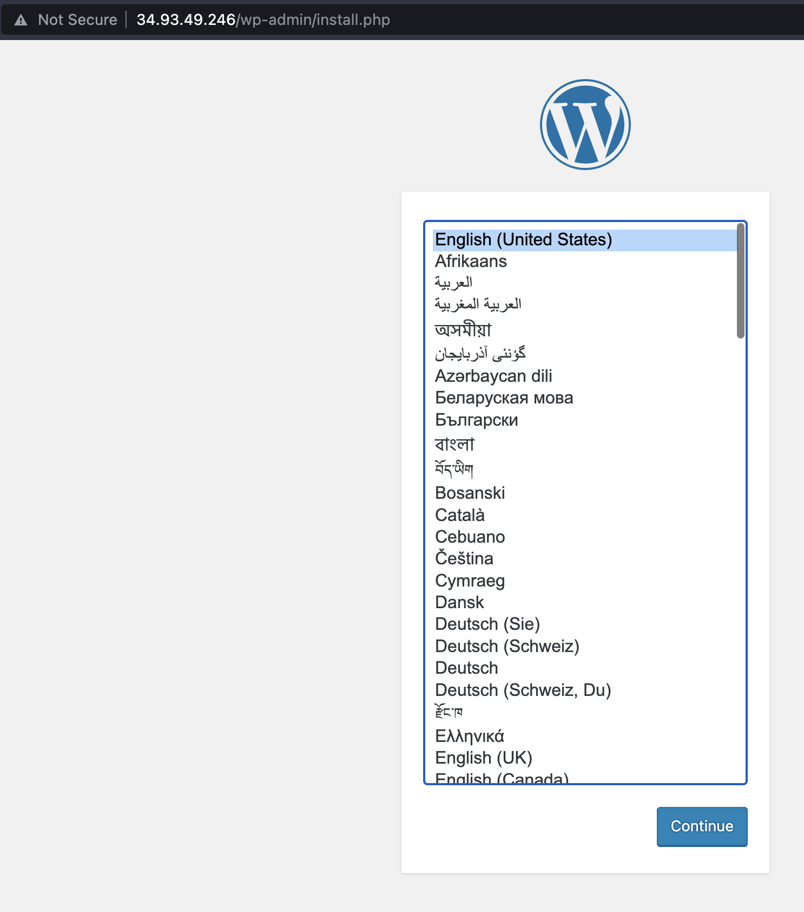

# gke-terraform-3tier

## Description
A demo project to demonstrate how to create a Kubernetes private cluster in [Google Kubernetes Engine](https://cloud.google.com/kubernetes-engine/docs/concepts/kubernetes-engine-overview) (GKE) using [terraform.io](terraform.io).

## Architecture

The scripts in this repository will create the following GCP resources (mostly) via [Terraform](https://terraform.io):

* Create an Admin GCP project. Within it, create a service account `terraform` and GCS bucket `gs://<projectId>-terraform-state`.
  * The Service Account to be used by Terraform to create resources across developmenet enviornments.
  * The GCS bucket to be used for saving Terraform states.
<br><br>
* Create a development GCP project. Within it, create the following GCP resources
  * A the VPC and a Subnet that will host the GKE cluster
  * A GKE Cluster running Workload Identity with no public IPs on either the API or the worker nodes.
  * Nodepools hosting the working nodes
  * A Cloud NAT router to provide egress access to nodes and pods
  * A dedicated GCE instance acting as jumphost to enable users (like admins and developers) to use SSH Tunneling to access the cluster.
  * Services running within `pods` access other GCP APIs via Workload Identity.

## Architecture Diagram


## Pre-requisites
- Install Google Cloud SDK and Terraform using [Homebrew](https://brew.sh):
  ```
    brew update
    brew install Caskroom/cask/google-cloud-sdk
    brew install terraform
  ```
- This project assumes that your account have enough permissions that allows you to create and destroy projects in the organization.
- This project assumes you already have a Billing account set up.
- You  may need to accept terms under [GCP Privacy & Security](https://console.cloud.google.com/iam-admin/privacy)


## Cost
Google Cloud Storage, Compute and Kubernetes Engine are billable components.

## Steps to spin-up infrastructure
- Run the `./scripts/init_admin_project.sh` to create a GCP admin project.
  ```
    ./scripts/init_admin_project.sh -P <admin-project-id> -B <your_billing_account_id> -S <path-to-save-service-account-key> [-h]
  ```
  Example:
  ```
    ./scripts/init_admin_project.sh -P a-demo-admin -B 01F1F5-E0C8BF-A86050 -S "/Users/agni/tf-admin.json"
  ```
  Note: this script must be run by a human with admin rigths for the project_id.
  <br><br>
  You can find the value of <your_billing_account_id> using the following commands:
  ```
    gcloud alpha billing accounts list
  ```

  Once the admin project is created:
    - The script will create a GCS bucket `gs://<projectId>-terraform-state` within the admin project -- to be used for saving Terraform states.
    - The script will create a Service Account `terraform` within the admin project -- to be used by Terraform to create resources.
<br><br>
- Run `./scripts/init_app_project.sh` to create a GCP project to be used to host the GKE cluster.
  ```
    ./scripts/init_app_project.sh -P <project-id> -S <terraform service account email> [-h]
  ```
  Example:
  ```
    ./scripts/init_app_project.sh -P a-demo-dev -S terraform@a-demo-admin.iam.gserviceaccount.com
  ```
  Note: this script must be run by a human with admin rigths for the project_id.

  Once the project is created:
    - The script will provide the Terraform service account necessary permissions in the app project to create\update\delete resources on our behalf.

- Run `./scripts/create_infra.sh` to provision the VPC, Subnet, GKE cluster, Jumphost and NAT using [Terraform](https://terraform.io)
  ```
    ./scripts/create_infra.sh
  ```

## Steps to access Kubernetes API (run kubectl commands)
Access to Kubernetes API is only possible via Jumphost by Identity Aware Proxy (IaP) <br>

- Run `./scripts/connect_cluster.sh` to establish connection. Once connected, run kubectl commands using the following syntax: 

  ```
  HTTPS_PROXY=localhost:8888 <kubectl command>
  ```
  Example
  ```
  ❯ HTTPS_PROXY=localhost:8888 kubectl get nodes

  NAME                                                  STATUS   ROLES    AGE   VERSION
  gke-private-cluster-nodepool-standard-5fab9583-dc4c   Ready    <none>   13m   v1.24.8-gke.2000
  gke-private-cluster-nodepool-standard-be3b76f5-j45z   Ready    <none>   13m   v1.24.8-gke.2000
  gke-private-cluster-nodepool-standard-fa4b0a5b-3qqc   Ready    <none>   13m   v1.24.8-gke.2000
  ```

## Steps to SSH to the jumphost

- Run `./scripts/ssh_jumphost.sh` to SSH to the jumphost box: 

  ```
  ❯ ./scripts/ssh_jumphost.sh

    Linux private-cluster-jumphost 5.10.0-19-cloud-amd64 #1 SMP Debian 5.10.149-2 (2022-10-21) x86_64

    The programs included with the Debian GNU/Linux system are free software;
    the exact distribution terms for each program are described in the
    individual files in /usr/share/doc/*/copyright.

    Debian GNU/Linux comes with ABSOLUTELY NO WARRANTY, to the extent
    permitted by applicable law.
    ac7493@private-cluster-jumphost:~$ pwd
    /home/ac7493

  ```

## Test - Deploying WordPress and MySQL with Persistent Volumes in the cluster

To ensure the setup is correct, we will deploy a Wordpress app in the cluster. The Kubernetes yaml scripts are downloaded from [here](https://github.com/kubernetes/examples/tree/master/mysql-wordpress-pd) 

- Open `./k8s/secrets.yaml` and replace YOUR_PASSWORD with the password you want to use. Make sure the password is base64 encoded.
- Run `./scripts/deploy_wordpress.sh` to deploy WordPress app in the cluster

  ```
    ./scripts/deploy_wordpress.sh

    Fetching cluster endpoint and auth data.
    kubeconfig entry generated for private-cluster.
    
    service/wordpress-mysql created
    persistentvolumeclaim/mysql-pv-claim created
    deployment.apps/wordpress-mysql created
    secret/mysql-pass created
    service/wordpress created
    persistentvolumeclaim/wp-pv-claim created
    deployment.apps/wordpress created

    NAME         TYPE     DATA   AGE
    mysql-pass   Opaque   1      12m

    NAME             STATUS   VOLUME                                     CAPACITY   ACCESS MODES   STORAGECLASS   AGE
    mysql-pv-claim   Bound    pvc-46d2af55-ef5e-4354-ab2a-e1dd8528f62e   20Gi       RWO            standard-rwo   12m
    wp-pv-claim      Bound    pvc-47fdc780-de6d-4260-bbc4-3183a15968eb   20Gi       RWO            standard-rwo   12m

    NAME                               READY   STATUS    RESTARTS   AGE
    wordpress-55c9ff4b54-sc6l2         1/1     Running   0          12m
    wordpress-mysql-6946cdb7cd-7ljjb   1/1     Running   0          12m

    NAME        TYPE           CLUSTER-IP   EXTERNAL-IP    PORT(S)        AGE
    wordpress   LoadBalancer   10.2.12.46   34.93.49.246   80:32398/TCP   12m

    Use the external IP in the browser to access the Wordpress site

  ```
  


## Steps to tear-down the infrastructure

- Run `./scripts/destroy_wordpress.sh` to delete the Wordpress application from the cluster
  ```
    ./scripts/destroy_wordpress.sh

    Fetching cluster endpoint and auth data.
    kubeconfig entry generated for private-cluster.
    
    service "wordpress-mysql" deleted
    persistentvolumeclaim "mysql-pv-claim" deleted
    deployment.apps "wordpress-mysql" deleted
    secret "mysql-pass" deleted
    service "wordpress" deleted
    persistentvolumeclaim "wp-pv-claim" deleted
    deployment.apps "wordpress" deleted
  ```

- Run `./scripts/destroy_infra.sh` to tear-down the VPC, Subnet, GKE cluster, Nodepools, Jumphost and NAT
  ```
    ./scripts/destroy_infra.sh
  ```

- Run `./scripts/destroy_project.sh` to tear down the GCP projects
  ```
    ./scripts/destroy_project.sh -P <project-id> 
  ```
  Example:
  ```
    ./scripts/destroy_project.sh -P -a-demo-dev
    ./scripts/destroy_project.sh -P -a-demo-admin
  ```
  Note: this script must be run by a human with admin rigths for the project_id.